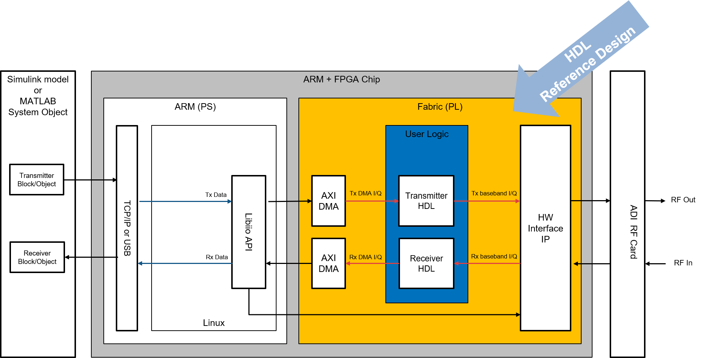
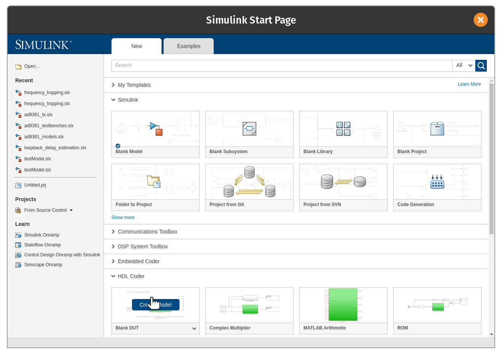
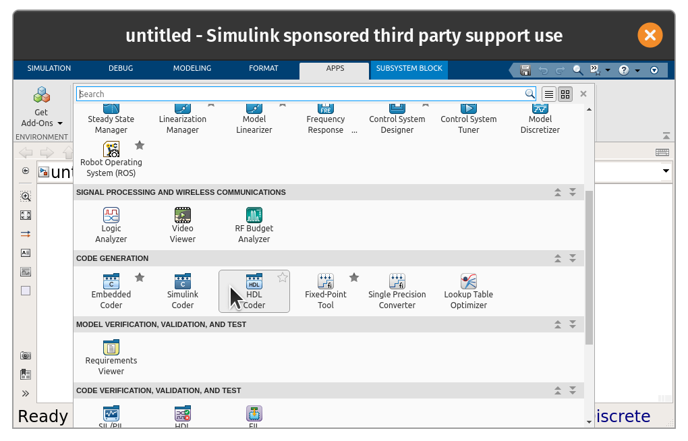
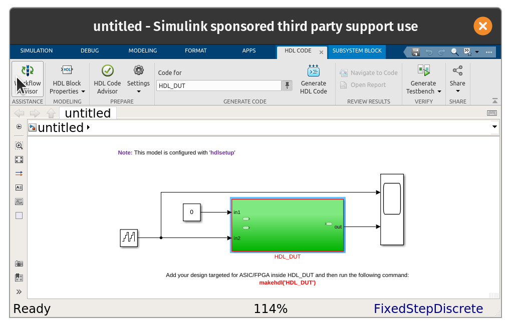
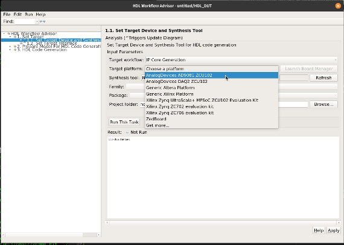


# HDL Targeting with HDL-Coder

High-Speed Converter Toolbox supports the IP Core generation flow from MathWorks which allows for automated integration of DSP into HDL reference designs from Analog Devices. This workflow will take Simulink subsystems, run HDL-Coder to generate source Verilog, and then integrate that into a larger reference design. The figure below is a simplified block diagram of a SoC (Fabric+ARM) device, where specialized IP are inserted into the receive and transmit datapaths. This is supported on specific FPGA families and high-speed based reference designs. This support is based on the Zynq HDL-Coder and support



## Recommended Review

- [Getting started with Zynq](https://www.mathworks.com/support/search.html/videos/getting-started-with-zynq-80338.html?fq%5B%5D=asset_type_name:video&fq%5B%5D=category:hdlcoder/index&page=1)

## Getting Started

To perform targeting will require FPGA vendor tools for the FPGA system. For Xilinx this will be Vivado and the toolbox will require specific versions for each release. For the current release this is Vivado 2021.2. Using other versions are not supported. To build the necessary BOOT.BIN files will require the Xilinx SDK as well.

Once you have the installed the necessary 3rd party tools MATLAB needs to be told where they are installed by use of the [hdlsetuptoolpath](https://www.mathworks.com/help/hdlcoder/ref/hdlsetuptoolpath.html) command. For Windows the following MATLAB command can be used:

```matlab
hdlsetuptoolpath('ToolName', 'Xilinx Vivado', 'ToolPath', 'C:\Xilinx\Vivado\2021.2\bin\vivado.bat');
```

or Linux:

```matlab
hdlsetuptoolpath('ToolName', 'Xilinx Vivado', 'ToolPath', '/opt/Xilinx/Vivado/2021.2/bin/vivado');
```

Please change the tool path if it is different on your system.

### Checking For Supported Designs

To verify that the ADI reference designs are available to [HDL Workflow Advisor](https://www.mathworks.com/help/hdlcoder/ug/overview-of-workflows-in-hdl-workflow-advisor.html) a Simulink model needs to be opened. To do so launch Simulink with the following command:

```matlab
simulink
```

After it launches open a "Blank DUT" model from the "HDL Coder" dropdown of the Simulink Start Page.


<!--  -->

After the model opens, click on the green subsystem to select it. Then open the "Apps" tap, open the apps menu and
scroll down to HDL-Coder.


<!--  -->

This will open the HDL-Coder menu, from here the Workflow Advisor is selectable. Click on it to launch the advisor.


<!--  -->

Once launch go to Step 1.1 on the left side column. Then on the right side of the window select "IP Core Generation" for "Target workflow". Then the ADI reference designs should be available in the "Target platform" menu as so:


<!--  -->

## Moving Bitstreams To Hardware

Unlike support packages provided by MathWorks, the update process for the bitstreams requires the creation of a BOOT.BIN file which will be compatible with the ADI SD card. BOOT.BIN's contain the bitstream (system_top.bit), FSBL, and u-boot for ADI platforms.

First, make sure you have a valid SD card for your platform with the necessary device tree and kernel image selected. [Follow this process here](https://wiki.analog.com/resources/tools-software/linux-software/embedded_arm_images).

Once your SD card is ready, in step 4.3 "Build FPGA Bitstream" of HDL Workflow Advisor select a custom Tcl file for synthesis build. Utilize this [adi_build.tcl](https://github.com/analogdevicesinc/HighSpeedConverterToolbox/blob/master/CI/scripts/adi_build.tcl) file for Linux or this [adi_build_win.tcl](https://github.com/analogdevicesinc/HighSpeedConverterToolbox/blob/master/CI/scripts/adi_build_win.tcl) file for Windows located within the BSP as your custom tcl file. 


Once the bitstream is built it will generate the BOOT.BIN necessary for booting your system. Place the generated BOOT.BIN in the root of your ADI SD card's BOOT partition.
